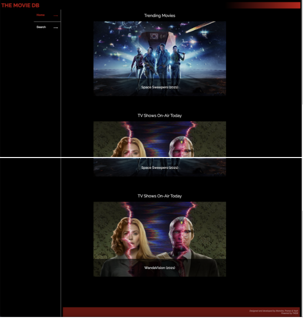
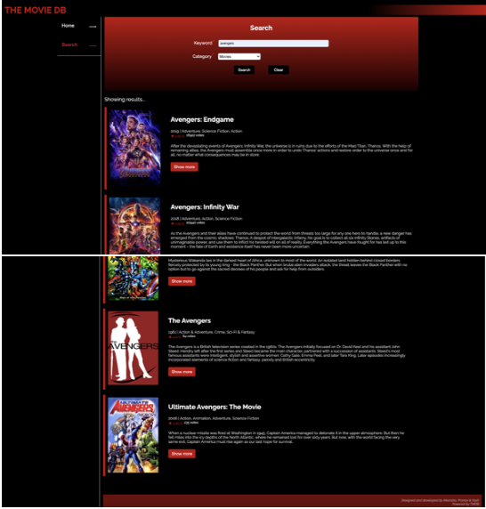
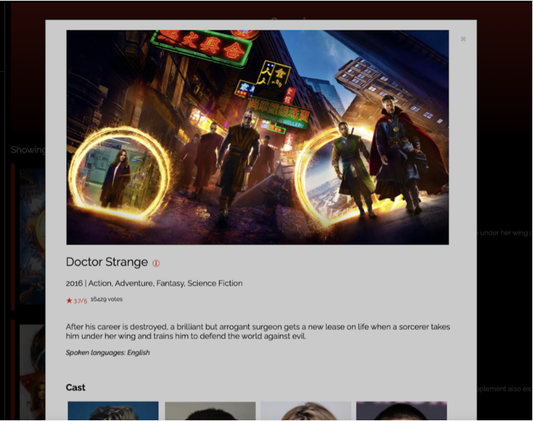
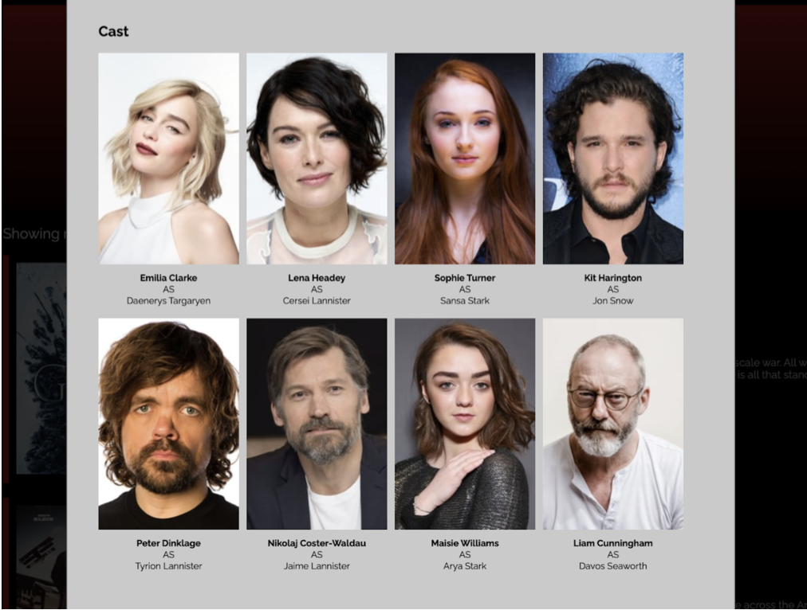
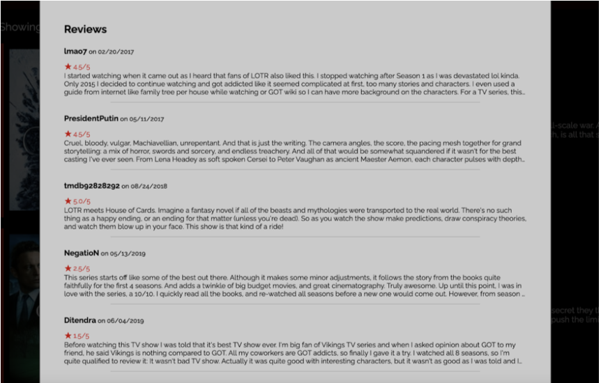

# THE-MOVIE-DB
1. Deployed a Flask web application on Azure. 
2. Created web pages using HTML, CSS, JavaScript, DOM, JSON and the
XMLHttpRequest object.
3. Used third-party API calls (The Movie Database API) from your web
application.

